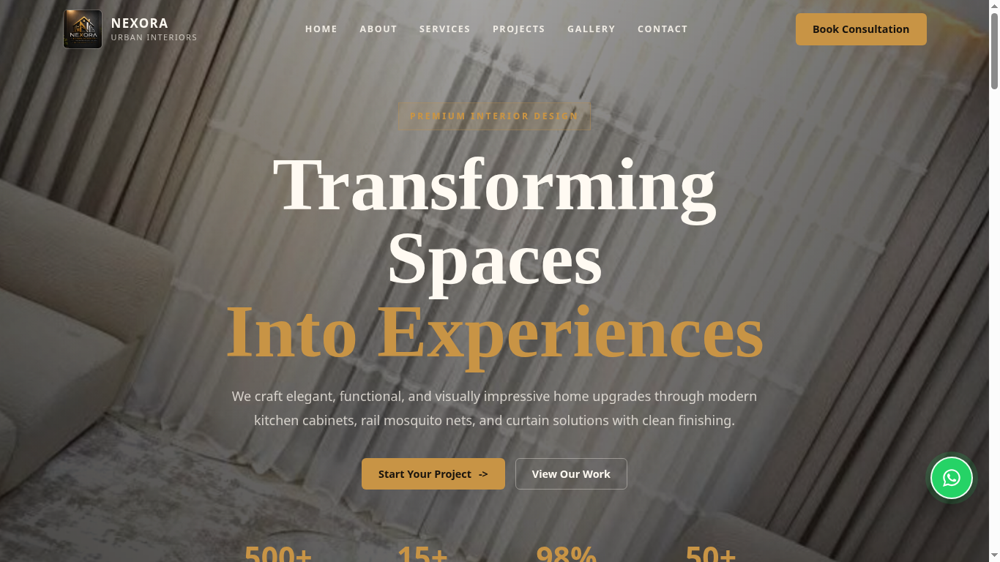
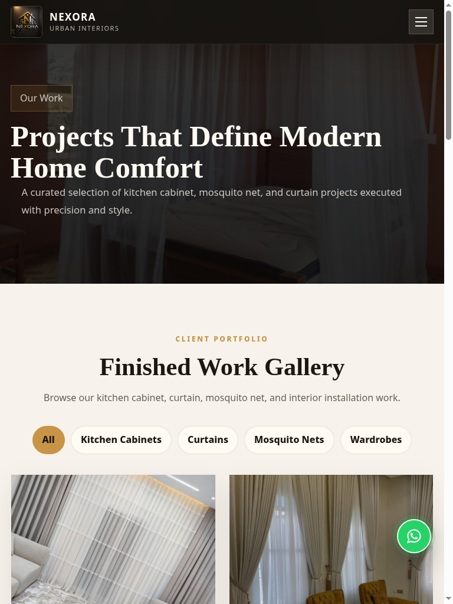
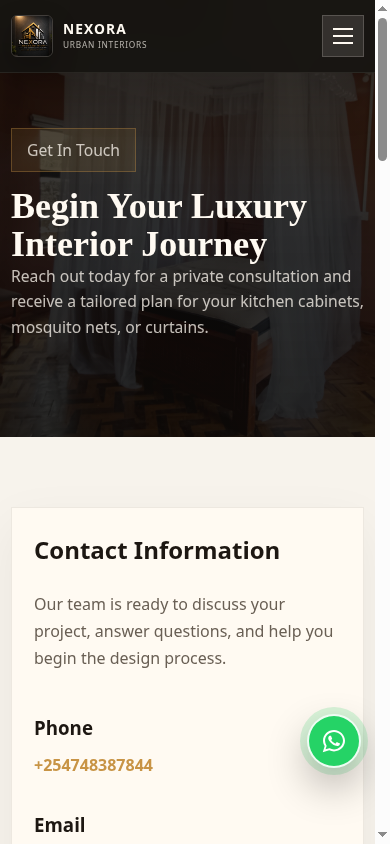
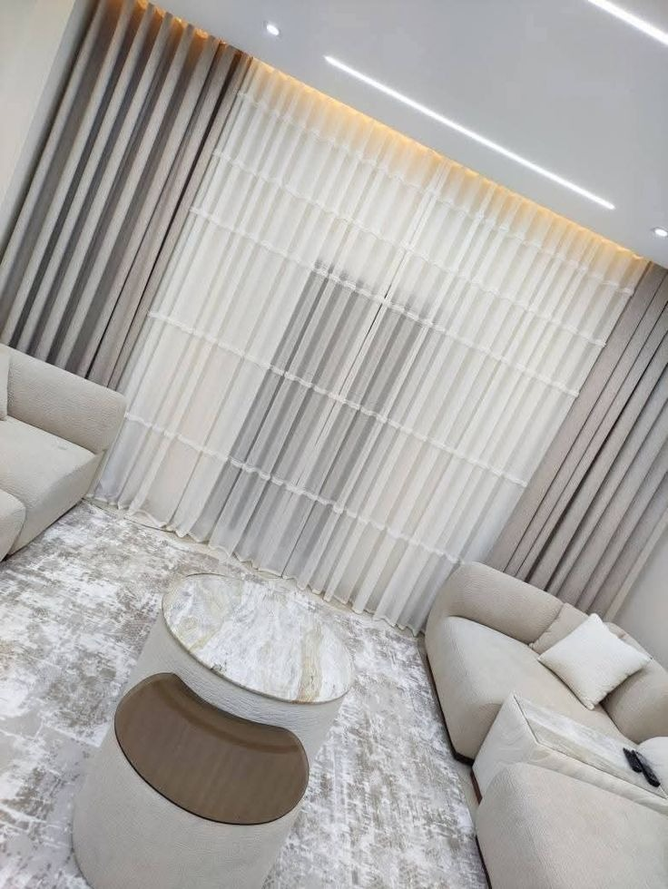

# NEXORA-URBAN-INTERIORS-AND-CONSTRUCTION-HUB-

Nexora Urban Interiors offers modern interior design, kitchen cabinets, gypsum ceilings, wardrobes, renovations, and construction services. We transform homes and commercial spaces with stylish, affordable, and high-quality interior solutions.

Static multi-page website for Nexora Urban Interiors and Construction Hub.

## Screenshots

### Laptop Home View


### Tablet Portfolio View


### Mobile Contact View


## Project Structure

```text
Nexora/
|-- index.html
|-- about.html
|-- services.html
|-- portfolio.html
|-- gallery.html
|-- contact.html
|-- style.css
|-- main/
|   `-- main.js
|-- assets/
|   `-- nexora-logo.jpeg
|-- slideshow-images/
|   `-- img-*.jpeg
|-- portfolio-images/
|   |-- img-*.jpeg
|   `-- portfolio-manifest.js
`-- docs/
    `-- screenshots/
```

## Running Locally

This is a static website. Use any local static server from the project folder:

```bash
python3 -m http.server 4173
```

Open:

```text
http://127.0.0.1:4173/index.html
```

## Render Deployment

This project is ready to deploy on Render as a Static Site.

Dashboard values:

- Service type: `Static Site`
- Branch: `main`
- Build command: `npm run build`
- Publish directory: `dist`

The repository also includes `render.yaml` for Render Blueprint deployments.

## Pages

- `index.html`: landing page with hero slideshow, service previews, portfolio preview, testimonials, CTA, and footer.
- `about.html`: company overview and value proposition.
- `services.html`: service details.
- `portfolio.html`: filterable project gallery with lightbox.
- `gallery.html`: simple image gallery.
- `contact.html`: contact information and email form.

## Images

There are two separate image systems.

### Hero Slideshow Images

Hero slideshow images live in:

```text
slideshow-images/
```

The landing-page hero uses these images directly in `index.html`:

```html

```

To add a slideshow image:

1. Add the file to `slideshow-images/`.
2. Add a matching `` line inside the `.hero-bg` block in `index.html`.
3. If you add more than 11 slides, update the slideshow timing in `style.css` near `.hero-slide` and `@keyframes heroSlideshow`.

### Portfolio and Gallery Images

Portfolio images live in:

```text
portfolio-images/
```

The portfolio and gallery pages do not hardcode a fixed image count. They read image data from:

```text
portfolio-images/portfolio-manifest.js
```

To add portfolio images:

1. Place the image in `portfolio-images/`.
2. Open `portfolio-images/portfolio-manifest.js`.
3. Add a new entry:

```js
{
  file: "new-project.jpeg",
  category: "Curtains",
  title: "Full-Height Bedroom Curtains"
}
```

Supported categories currently used by filters:

- `Kitchen Cabinets`
- `Curtains`
- `Mosquito Nets`
- `Wardrobes`

If you add a new category, also add a matching filter button in `portfolio.html`:

```html
<button class="portfolio-filter-btn" type="button" data-filter="New Category">New Category</button>
```

## Logo and Favicon

The site logo is:

```text
assets/nexora-logo.jpeg
```

It is used in:

- Header/topbar
- Footer
- Favicon
- Apple touch icon

To replace the logo, overwrite `assets/nexora-logo.jpeg` with a square image and keep the same file name.

## Contact Form

The contact form in `contact.html` submits to FormSubmit:

```html
action="https://formsubmit.co/ajax/nexoraurbaninteriors@gmail.com"
```

The submitted email uses FormSubmit's `box` template and is structured with named fields:

- `Business`
- `Source`
- `Name`
- `Email`
- `Phone`
- `Service`
- `Message`

Important:

- FormSubmit requires first-time email activation for the recipient email. A test POST on 2026-06-02 returned an activation-required response and FormSubmit said it sent an Activate Form email to nexoraurbaninteriors@gmail.com.
- A `mailto:` fallback is included if the POST request fails.
- To change the recipient, replace `nexoraurbaninteriors@gmail.com` in the form `action` and in the fallback `mailto:` URL inside the contact-page script.

## WhatsApp Floating Button

Every page has a floating WhatsApp icon link near the lower-right side. Styling is in `style.css` under:

```css
.whatsapp-float
```

To change the phone number, update the `href` on `.whatsapp-float` links in all HTML pages.

## Responsive Layout

Responsive behavior is handled in `style.css` with these breakpoints:

- `1180px`: laptop/smaller desktop adjustments.
- `1020px`: tablet navigation and two-column layouts.
- `700px`: phone single-column layout and smaller spacing.
- `430px`: compact phone refinements.

The site has been checked at:

- Phone: `390x844`
- Tablet: `768x1024`
- Laptop: `1366x768`

## Footer Branding

All page footers include:

```text
Built by Prince Dennis Labs
```

The style is controlled by:

```css
.builder-credit
```

## Verification Checklist

Before handing off changes:

1. Start a local server: `python3 -m http.server 4173`
2. Open all six pages.
3. Check that no images are broken.
4. Check the mobile menu at phone/tablet widths.
5. Check portfolio filters and lightbox.
6. Check gallery images.
7. Check contact form fields.
